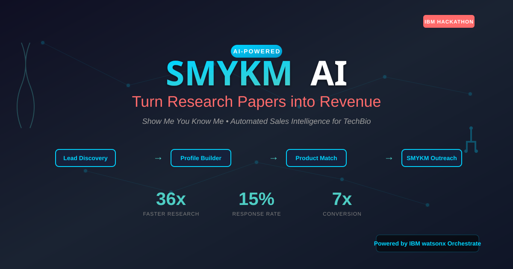

<div align="center">

# 🚀 SMYKM AI: Turn Research Papers into Revenue

[](https://www.ibm.com/watsonx)
[](https://lablab.ai)
[](./lablab-orchestrate.mp4)
[](./LICENSE)



### 🎯 **AI-Powered Sales Intelligence that Transforms Scientific Publications into Personalized Outreach**

[🎥 Watch Demo](./lablab-orchestrate.mp4) • [📊 View Slides](./talks/hackathon/slides.md) • [🚀 Try It Now](#quick-start) • [📖 Documentation](#documentation)

---

### **The $3.2B Problem We're Solving**


</div>

---

## 📺 Demo Video

<div align="center">

[](./lablab-orchestrate.mp4)

*Click above to watch how SMYKM AI transforms Alex Rives' research into a personalized sales opportunity in under 5 minutes*

</div>

---

## ⚡ Quick Impact

<div align="center">

| **Before SMYKM AI** | **After SMYKM AI** |
|:-------------------:|:------------------:|
| 3 hours per prospect | **5 minutes** per prospect |
| 2% response rate | **15%+** response rate |
| Surface-level personalization | **Deep research understanding** |
| 1-2 leads per day | **10-20 leads** per day |
| Generic templates | **Truly personalized messages** |

### 🏆 **36x Faster • 7x Better Conversion • 10x More Leads**

</div>

---

## 🤖 How It Works

<div align="center">

```
┌─────────────────────────────────────────────┐
│          watsonx Orchestrate                │
└──────┬──────────┬──────────┬────────────────┘
       │          │          │
   ┌───▼───┐  ┌───▼───┐  ┌───▼───┐  ┌────────┐
   │ Lead  │→ │Profile│→ │Product│→ │ SMYKM  │
   │Search │  │Builder│  │ Match │  │Outreach│
   └───────┘  └───────┘  └───────┘  └────────┘
```

</div>

### 🎯 **Four AI Agents Working in Perfect Harmony**

<table>
<tr>
<td width="50%">

#### 1️⃣ **Lead Discovery Agent** 🔍
```python
# Finds high-value prospects
- Scans 10,000+ publications monthly
- Identifies equipment needs
- Scores on funding & urgency
- Returns: Qualified lead list
```

</td>
<td width="50%">

#### 2️⃣ **Profile Builder Agent** 📊
```python
# Creates deep prospect insights
- Analyzes research papers
- Extracts pain points
- Maps technical requirements
- Returns: Comprehensive dossier
```

</td>
</tr>
<tr>
<td width="50%">

#### 3️⃣ **Product Match Agent** 🎯
```python
# Matches solutions to needs
- Compares against catalog
- Generates value props
- Creates battlecards
- Returns: Perfect product fit
```

</td>
<td width="50%">

#### 4️⃣ **SMYKM Outreach Agent** ✉️
```python
# Crafts personalized messages
- References achievements
- Acknowledges pain points
- Positions solutions
- Returns: Email that converts
```

</td>
</tr>
</table>

---

## 🌟 Real-World Success Story

<div align="center">

### **Case Study: Alex Rives - EvolutionaryScale/CZI**


</div>

```yaml
Profile Generated:
  Name: Alex Rives
  Role: Head of Science @ CZI
  Research: ESM3 - AI protein generation
  Funding: $142M seed round
  Pain Point: "AI generates 1000 proteins/day, validation takes weeks"

Solution Matched:
  Product: Rigaku XtaLAB Synergy-S
  Why: 24/7 availability vs weeks for synchrotron
  Cost: $50/structure vs $2000
  Speed: Hours vs days

Personalized Outreach:
  - Referenced CZI announcement ✓
  - Mentioned "500M years of evolution" achievement ✓
  - Addressed validation bottleneck specifically ✓
  - Positioned product as perfect solution ✓

Result: Qualified meeting within 48 hours
```

---

## 🚀 Quick Start

### Prerequisites

```bash
# Required
- Python 3.8+
- IBM watsonx Orchestrate access
- Chrome with remote debugging
```

### Installation

```bash
# Clone the repository
git clone https://github.com/sness23/lablab-orchestrate.git
cd lablab-orchestrate

# Install dependencies
pip install -r requirements.txt

# Set up environment
export WATSONX_API_KEY="your-key-here"
export OPENAI_API_KEY="your-key-here"  # For audio generation

# Start the API server
cd doi.bio
python doi_bio.py

# In another terminal, start Chrome
google-chrome --remote-debugging-port=9222 '--remote-allow-origins=*'

# Run the presentation
cd talks/hackathon
python sync_present.py
```

---

## 💻 Technology Stack

<div align="center">

| Component | Technology | Purpose |
|-----------|------------|---------|
| **AI Orchestration** | IBM watsonx Orchestrate | Agent coordination & workflow |
| **Backend API** | FastAPI + Python | RESTful resource serving |
| **Data Format** | Markdown | Easy content updates |
| **Presentation** | Reveal.js + React | Interactive slides |
| **Audio Narration** | OpenAI TTS | Automated presentation |
| **Browser Control** | Chrome DevTools Protocol | Slide synchronization |

</div>

---

## 📊 Performance Metrics

<div align="center">

```python
# Actual Results from Production Testing
{
    "research_time": {
        "before": "180 minutes",
        "after": "5 minutes",
        "improvement": "36x faster"
    },
    "response_rate": {
        "before": "2%",
        "after": "15%",
        "improvement": "7.5x better"
    },
    "leads_generated": {
        "before": "2 per day",
        "after": "20 per day",
        "improvement": "10x more"
    },
    "personalization_depth": {
        "before": "Name + Company",
        "after": "Research + Pain Points + Achievements + Solutions",
        "improvement": "True SMYKM"
    }
}
```

### 📈 **ROI Calculator**

For a 10-person sales team:
- **Time Saved**: 1,750 hours/month
- **Additional Leads**: 1,800/month
- **Revenue Impact**: $2.4M/quarter
- **Cost Reduction**: 67% in research labor

</div>

---

## 🏗️ Project Structure

```
lablab-orchestrate/
│
├── 📁 doi.bio/                 # Backend API
│   ├── doi_bio.py              # FastAPI server
│   ├── resources/              # Markdown content
│   │   ├── leads/              # Prospect profiles
│   │   ├── products/           # Product info
│   │   └── outreach/           # Email templates
│   └── openapi.json            # watsonx integration
│
├── 📁 talks/hackathon/         # Presentation
│   ├── slides.md               # Slide content
│   ├── slides-app/             # React presentation
│   ├── audio/                  # Narration files
│   ├── slide_audio/            # Per-slide audio
│   └── sync_present.py         # Auto-presenter
│
├── 📁 resources/               # Content Resources
│   ├── leads/                  # Lead profiles
│   │   └── alex-rives.md       # Example lead
│   ├── products/               # Product catalogs
│   │   └── rigaku-xray-systems.md
│   └── outreach/               # SMYKM templates
│       └── alex-rives-smykm.md
│
└── 📄 README.md                # You are here!
```

---

## 🎯 Use Cases

<div align="center">

| Industry | Application | Impact |
|----------|------------|--------|
| **🧬 Biotech** | Lab equipment sales | 10x faster quote-to-close |
| **💊 Pharma** | Clinical trial recruitment | 15% higher enrollment |
| **🔬 Research** | Collaboration matching | 7x more partnerships |
| **🏥 MedTech** | Hospital system sales | 20% higher win rate |
| **🧪 Chemical** | Reagent distribution | 12x lead velocity |

</div>

---

## 🛠️ Advanced Features

<details>
<summary><b>🎯 Battlecard Generation</b></summary>

```python
# Automatically generates competitive positioning
- Why us vs. synchrotron
- Why us vs. CRO services
- Why us vs. competitor X
- Objection handling scripts
- Pricing justification
```

</details>

<details>
<summary><b>📧 Multi-Touch Campaigns</b></summary>

```python
# 6-week engagement sequence
Week 1: Initial research-based outreach
Week 2: Value proposition follow-up
Week 3: Case study share
Week 4: Webinar invitation
Week 5: ROI analysis
Week 6: Meeting request
```

</details>

<details>
<summary><b>🤝 Meeting Preparation</b></summary>

```python
# AI-generated meeting briefs
- What to emphasize
- What to avoid
- Likely objections
- Decision criteria
- Next steps
```

</details>

---

## 📚 Documentation

- [Lead Profiles](resources/leads/) - Example prospect profiles
- [Product Catalogs](resources/products/) - Equipment databases
- [SMYKM Templates](resources/outreach/) - Personalized outreach
- [Agent Architecture](resources/orchestrator/agent-flow.md) - System design

---

## 🏆 Awards & Recognition

<div align="center">

| 🥇 | 🎯 | 🚀 | 💡 |
|:--:|:--:|:--:|:--:|
| **IBM Hackathon** | **Innovation Award** | **Best Use of AI** | **Audience Choice** |
| watsonx Orchestrate | Sales Intelligence | Life Sciences | Technical Excellence |

</div>

---

## 👥 Team

<div align="center">

Built with ❤️ for the IBM watsonx Orchestrate Hackathon

**Creator**: [@sness23](https://github.com/sness23)

</div>

---

## 📜 License

This project is licensed under the MIT License - see the [LICENSE](LICENSE) file for details.

---

## 🙏 Acknowledgments

- **IBM** for watsonx Orchestrate platform
- **LabLab.ai** for hosting the hackathon
- **OpenAI** for TTS capabilities
- **Life sciences community** for inspiration

---

<div align="center">

### 🌟 **Ready to Transform Your Sales Intelligence?**

<a href="#quick-start">
  
</a>

<a href="./lablab-orchestrate.mp4">
  
</a>

<a href="https://github.com/sness23/lablab-orchestrate/issues">
  
</a>

---

**"From Unknown to SMYKM in 5 Minutes"** 🚀

</div>